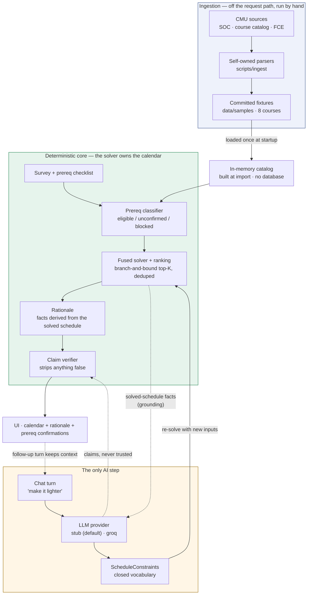

# Architecture: what we built, where it runs, and why

> **Scope.** This document is the architectural narrative for cmu-scheduler: the system we
> actually built, the cloud services it actually uses, and the reasoning behind each choice —
> including the places where we deliberately did *not* build what we originally designed.
>
> It is written to be **checkable against the repo**. Where the code and our original design
> diverge, this document says so rather than describing the design as though it were built.
> For the original design and its rationale see [`project-context.md`](project-context.md);
> for the per-stage record of authorship and review see [`PROVENANCE.md`](../PROVENANCE.md).

---

## 1. What we built

A conversational course-scheduling assistant for CMU students. A student fills in a short
survey, ticks off the prerequisites they've already taken, and gets conflict-free,
requirement-satisfying schedules ranked by fit. They can then talk to the calendar — ask about
it ("what's my workload?") or change it ("swap the Friday class", "make it lighter").

### The one rule everything follows

**Hard scheduling logic is deterministic. The language model only proposes. A deterministic
verifier checks every factual claim before it reaches the student.**

This is not a stylistic preference; it is the reason the product is worth anything. A tool
whose entire value is a *correct* schedule cannot afford a model that occasionally invents a
section, violates a prerequisite, or double-books a student against a commitment it was told
about. So we confined the model to what it is actually good at — reading intent out of fuzzy
language — and gave it no mechanism to act on the calendar.

Concretely, the model's authority is exactly two things:

1. decide whether a chat turn is a **question** or a **change request**; and
2. if it's a change, fill a closed `ScheduleConstraints` struct — avoid these days, cap units
   here, no class before/after, drop this course.

Those constraints are then translated into the solver's ordinary inputs (a units cap,
commitment blocks, an exclusion set) and the **solver** builds the schedule. There is no field
in which a model can express "put 15-213 here." The worst a bad proposal can do is produce a
valid schedule the student didn't ask for — never an invalid or fabricated one.

Two later hardenings extend that rule to the edges. **Grounding:** every chat prompt now
carries per-section facts (meeting days, begin/end times, titles) and the names of the
degree-requirement groups the schedule advances — all computed deterministically upstream — so
even "why is 15-213 on Mondays?" is answered from solver data, not model recall
(`orchestrator.build_chat_messages`). **Failure containment:** a provider that misbehaves —
missing config, transport failure, or output that doesn't parse into the `ChatTurn` schema —
is treated like a failed verification: `/chat` catches `ProviderError` and returns an honest
fallback with no claims, constraints unchanged, and the calendar untouched
(`backend/app/main.py`). A broken model can degrade the conversation; it cannot degrade the
schedule.

### The system as built



Read the arrows into `SOLVE`: **every** calendar the student ever sees comes out of that one
box. The chat's arrow reaches it carrying *constraints*, not a schedule. The dashed arrow *out*
of the solver carries grounding facts the model may repeat but cannot alter; the LLM's only
other arrow is a dashed one into the verifier, which exists to throw its claims away if they
are false.

> [`architecture.svg`](architecture.svg) is this same **as-built** system rendered as a
> standalone image. It replaced Wendy's original hand-drawn sketch of the *target*
> architecture — a DynamoDB catalog store, semantic retrieval, an LLM that "explains and
> ranks" — which is preserved in git history (`1f4b408`); §4 and §8 explain why the design and
> the build diverge.

### Components as built

| Component | Module | Deterministic? |
|---|---|---|
| Prereq classifier (eligible / unconfirmed / blocked) | `backend/app/prereq.py` | yes |
| Fused solver + ranking (branch-and-bound top-K, deduped) | `backend/app/solver.py`, `ranking.py` | yes |
| Degree requirements | `backend/app/requirements.py`, `requirements_loader.py` | yes |
| Rationale: why a schedule was built + its verified facts | `backend/app/rationale.py` | yes |
| Claim verifier — the safety gate | `backend/app/verifier.py` | yes |
| Chat turn: intent + constraint proposal | `backend/app/orchestrator.py` | **no — the only AI step** |
| Provider abstraction (`stub` default, `groq`) | `backend/app/llm_provider.py` | n/a |
| API | `backend/app/main.py` | — |
| UI (stepper flow survey → checklist → schedule workspace; calendar, rationale, chat with per-turn changed/unchanged tags) | `frontend/src/` | yes |

### The two request paths

**Build / confirm — no LLM at all:**

```
survey ─▶ prereq classifier ─▶ fused solver + ranking ─▶ rationale + claim verifier ─▶ UI
        (eligible/unconfirmed/   (branch-and-bound,       (facts derived from the
         blocked)                 deduped top-K)           schedule, then gated)
```

**Chat — the LLM proposes; the solver disposes:**

```
"make it lighter" ─▶ LLM ─▶ ScheduleConstraints ─▶ same solver ─▶ rationale + verifier ─▶ UI
                     (classify + propose only)     (builds the actual new schedule)
```

Only `POST /chat` touches a model. `/survey`, `/recommend`, and `/confirm` are fully
deterministic — including every green ✓ checkmark in the UI, which is claim-verifier output
derived from the solved schedule, not model prose.

The `stub` provider deserves a note here: it is not a mock. On question turns it routes by
intent — workload, units, requirement coverage, "why is 15-213 on Mondays?", "why do I have
class on Friday?" — and answers each from the grounding facts; on modification turns it parses
days, times of day (`early` / `late` / `evening`), drop-by-course-number, and topic-based
requests ("lighter theory load" drops the matching course rather than capping units across the
board). All of it is deterministic keyword routing over the same facts a real model receives,
which is what makes the zero-key default path demoable rather than merely non-crashing.

---

## 2. Where it runs today

**One `t3.small` EC2 instance (Ubuntu 24.04) in `us-east-1`, inside an AWS Academy Learner Lab
sandbox.** Both tiers run on that single box as systemd units:

```
Browser ──▶ :80    frontend   (built React static bundle, served by `serve`)
        ──▶ :8000  backend    (FastAPI via uv/uvicorn)

On every boot:  refresh-ip.sh  reads the instance's NEW public IP from IMDSv2,
                rewrites frontend/.env (VITE_BACKEND_URL), and rebuilds the frontend.
```

Provisioning is a single `user-data.sh` pasted into the instance's user data at launch: it
installs Node and uv, clones the repo, builds both tiers, and installs three systemd units
(`scheduler-backend`, `scheduler-refresh`, `scheduler-frontend`). There is no IaC, no
container registry, and no build pipeline. See [`docs/deployment.md`](deployment.md).

**Cost:** roughly $0.02/hr, auto-stopped between lab sessions — on the order of $5–15 of lab
budget for a semester.

---

## 3. The cloud services we actually use

This is the complete list. It is short on purpose, and shorter than the design in
`project-context.md` §6 — section 4 explains why.

| Service | How we use it | Why this and not something else |
|---|---|---|
| **EC2** (`t3.small`, Ubuntu 24.04) | One instance running both tiers under systemd | The app is a single stateless process with an in-memory catalog. One box is the least machinery that runs it. `t2.micro` is too small for the `npm` build. |
| **EC2 security group** | Inbound 22 (SSH, my IP), 80 (frontend), 8000 (API) | The whole network boundary. A managed firewall we get for free; nothing else needed at this scale. |
| **EC2 key pair** | SSH access for updates and debugging | — |
| **EBS** (instance root volume) | Holds the cloned repo, both builds, and the committed catalog JSON | Implicit in EC2. We have no durable state worth putting anywhere else — see §4. |
| **IMDSv2** (instance metadata) | `refresh-ip.sh` reads the current public IPv4 at boot | This is what makes Learner Lab's changing IP a non-problem. Metadata needs no IAM credentials, which matters (below). |
| **IAM: `LabInstanceProfile`** | Attached to the instance per the lab's guidance | Pre-provisioned. We cannot create roles. **Our code never uses it** — see the note below. |

**Off-AWS, deliberately:**

| Service | Use | Why off-AWS |
|---|---|---|
| **GitHub** | Source of truth; the instance clones from it | The instance is disposable; the repo is the durable artifact. Losing the instance costs 20 minutes, not work. |
| **GitHub Actions** | CI: `uv run pytest` on push | Runs with no secrets and no cloud — see §5. |
| **Groq API** (optional) | The real LLM, when `LLM_PROVIDER=groq` | A plain HTTPS call that touches neither Bedrock nor IAM, so it works inside Learner Lab unchanged. Bills separately; never touches the AWS budget. |

> **A load-bearing detail: the app makes zero AWS API calls.** There is no `boto3`, no AWS SDK,
> no S3 read, no DynamoDB query anywhere in `backend/`. IMDSv2 metadata is reachable without
> credentials. This is *why* "Learner Lab forbids creating IAM roles" turned out to cost us
> nothing operationally: we never needed a role to do anything. The instance profile is
> attached, and unused.

### How configuration reaches the process

The backend reads all configuration from environment variables (`LLM_PROVIDER`, `LLM_MODEL`,
`GROQ_API_KEY`, `GROQ_BASE_URL`). In deployment those come from `/opt/app/backend/.env`, loaded
by **systemd's `EnvironmentFile=-`** directive — not by the application, which parses no `.env`
file. (Locally, `make backend` therefore does *not* pick up `backend/.env`; you export the vars
or use `uvicorn --env-file`, which needs `python-dotenv`.) No key, model ID, or base URL appears
in code, and `.env` is gitignored.

---

## 4. What we designed but did not build — and why

`project-context.md` §6 specifies a serverless-first AWS architecture: Lambda + EventBridge for
ingestion, S3 for raw artifacts, DynamoDB as the catalog store, OpenSearch Serverless for
semantic retrieval, Bedrock for LLM serving, API Gateway + Lambda on the request path,
CloudFront + S3 for the frontend, Cognito for auth, CloudWatch for observability.

**We built none of it.** That was the right call, and pretending otherwise would make this
document useless. Here is the honest accounting:

| Designed | Built? | Why not |
|---|---|---|
| **DynamoDB** catalog store | ❌ In-memory dicts from a committed 6.5 KB JSON file (**8 courses, 9 sections**) | At this size a database is pure overhead. `load_courses()` runs at import; lookups are dict hits. A DynamoDB table would add IAM, latency, and cost to replace `dict[str, Course]`. This is the single biggest gap between the design and reality — the catalog is a **demo fixture, not a real dataset**. |
| **Lambda + API Gateway** request path | ❌ uvicorn on EC2 | Each needs roles and policies we cannot create; the solver is CPU-bound branch-and-bound and cold starts are exactly the wrong tradeoff for a conversational tool (§6 admits this). A warm box has none of that. |
| **Lambda + EventBridge** ingestion | ❌ A CLI (`scripts/ingest/cli.py`) run by hand, in dry-run mode against committed fixtures | Ingestion is off the request path by design, so scheduling it buys nothing for a demo. FCE data is auth-gated and needs a manual CSV export anyway — an automated schedule would be theatre. |
| **S3** raw artifacts | ❌ Committed fixtures in `data/fixtures/` | Same reason: the fixtures *are* the audit trail, and they make CI hermetic. |
| **OpenSearch Serverless** semantic retrieval | ❌ Not built | With 8 courses there is nothing to retrieve. The chat's question/modification classifier replaced the structured-vs-fuzzy router this was meant to serve. |
| **Bedrock** LLM serving | ❌ Provider abstraction (`stub` / `groq`) | See §5 — this is the decision with the clearest cost. |
| **Cognito** auth / saved schedules | ❌ No accounts | No persistence means no identity to attach it to. |
| **CloudFront + S3** frontend | ❌ `serve` on :80 on the same box | One origin, one box, zero config. CloudFront in front of an IP that changes every session would be actively worse. |
| **CloudWatch** observability | ❌ `journalctl` on the box | One instance, one operator, logs read over SSH. |

The through-line: **every one of these services solves a scaling or isolation problem we do not
have.** We have 8 courses, one instance, one operator, and a four-hour session. Adopting them
would have bought complexity and spent budget without making a single answer more correct.

---

## 5. The three decisions that actually cost us something

A design document that only lists wins is a sales pitch. These are the trades.

### 5.1 Bedrock → a provider abstraction

**Originally:** "LLM serving = Amazon Bedrock — keeps the model call inside our AWS IAM/security
boundary."

**What we did:** defined one `LLMProvider.generate(messages, response_schema)` interface,
selected at runtime from `LLM_PROVIDER`, with two implementations — `stub` (deterministic,
offline, **the default**) and `groq` (OpenAI-compatible HTTPS).

**Why:** Learner Lab pins us to `us-east-1`/`us-west-2`, forbids creating IAM roles, expires the
session after ~4 hours, and **may not have Bedrock enabled at all.** An architecture whose only
AI path might not exist in the only environment we can demo in is not an architecture.

**What it cost:** the IAM-boundary property Bedrock was chosen *for*. Our model call now leaves
the AWS boundary to a third party.

**Why we accept it:** the model was never trusted in the first place. The claim verifier
re-checks every factual claim regardless of which provider produced it — a guarantee that does
not depend on where the model runs. `backend/tests/test_orchestrator.py` proves this by feeding
the *same* false claim through two different providers and requiring both to be caught. The
security story shifted from "trust the boundary" to "trust nothing, verify everything," which is
the stronger position anyway.

**What it bought:** Bedrock became *one more class someone could write later* rather than a
load-bearing assumption — and, because `stub` is the default, CI and the whole demo run with no
key, no network, and no cloud.

### 5.2 A real catalog → 8 committed courses

**What it cost:** this is the least honest-looking part of the system, so we should say it
plainly. The ingestion pipeline is real, self-owned, and tested — but what it has actually
parsed is committed fixtures, and the app serves an 8-course catalog. Every scaling claim in
`project-context.md` §6 is therefore **untested at scale**: we do not know that the
branch-and-bound solver stays fast across a real SOC, and dict lookups tell us nothing about
whether DynamoDB was the right store.

**Why we accept it:** the pipeline's *shape* is what the design commits to — parsed output
conforms to the same normalized models as the fixtures, so downstream code cannot tell the
difference. Swapping in a real scrape is an ingestion change, not an architecture change. But it
is a promise, not a demonstration.

### 5.3 Serverless-first → one EC2 instance

**What it cost:** every property serverless was chosen for. There is no scaling story, one
instance is a single point of failure, and the "spikes hard at registration" argument that
motivated the design is unaddressed.

**Why we accept it:** the spike is real for a product with users, and we have none. Learner Lab
gives us a four-hour session and a budget measured in single-digit dollars. One box that boots
clean in two minutes is the correct answer to *this* problem, and §6's own known tradeoff —
serverless cold starts on a conversational tool — points the same way for the request path.

---

## 6. How Learner Lab's constraints shaped the design

Four constraints, four design responses. Notably, three of them made the system *better* in ways
that outlive the sandbox.

| Constraint | Response | Outlives the sandbox? |
|---|---|---|
| **~4-hour session timer**, instance auto-stops | **No persistent server state.** The catalog and requirements are in-memory caches built at import and rebuilt on every start; no LLM client is cached across requests; conversation state (`history`, `constraints`) is client-held and echoed per turn. A cold start is always clean and a restart mid-conversation loses nothing. | **Yes** — statelessness is what makes the request path horizontally scalable later. |
| **Public IP changes every session** | `refresh-ip.sh` reads the current IP from IMDSv2 on every boot, rewrites `VITE_BACKEND_URL`, and rebuilds the frontend, ordered before it by systemd. | No — an artifact of the sandbox. A real deployment uses a stable DNS name. |
| **Cannot create IAM roles**; Bedrock may be absent | The provider abstraction (§5.1), and an app that makes **zero AWS API calls** — so there is no role to need. | **Yes** — provider-agnosticism is portability, not a workaround. |
| **Budget is single-digit dollars**; no secrets to spare | `stub` is the **default** provider: deterministic, offline, no key, no network. The full test suite and CI pass with zero cloud dependency, and the app is demoable the moment the instance boots. | **Yes** — a zero-dependency default path is a genuine engineering property. |

---

## 7. What changes with a real account

In rough priority order — each is a real gap, not a nice-to-have:

1. **Ingest a real catalog.** Everything else is speculation until the solver meets a full SOC.
   This is the one that turns §5.2's promise into a demonstration.
2. **Give the catalog a real home.** *Then* re-ask the DynamoDB question with a dataset that can
   answer it. It may still be the wrong tool.
3. **Stable DNS + TLS** (Route 53 + ACM), which deletes `refresh-ip.sh` and lets CORS tighten
   from `allow_origins=["*"]` — currently set for the demo, and the first thing to fix before
   anything real.
4. **Split the tiers** — static frontend to S3 + CloudFront, backend on Fargate or an ASG —
   once there is traffic to justify it.
5. **Reconsider Bedrock**, now genuinely as one new provider class, if the IAM boundary is worth
   more than provider portability in that context.
6. **Observability** (CloudWatch) at the point where "SSH in and read journalctl" stops scaling —
   i.e. the moment there is more than one instance or more than one operator.

---

## 8. Status of this document

Accurate as of the current `main`. Verified against the repo rather than asserted:

- `/recommend` and `/confirm` return complete rationales with `select_provider` rigged to raise —
  they invoke no model. The only provider call site is inside `/chat`, and a `ProviderError`
  there produces the claim-free fallback turn rather than a 500 (`backend/tests/test_api.py`).
- No `boto3` / AWS SDK import exists anywhere in `backend/`.
- The catalog is 8 courses / 9 sections / 6,552 bytes, loaded at import.
- Backend suite: 152 tests, passing with no key and no network.

**Known documentation drift** (the code is right; read these with the caveat):

- [`project-context.md`](project-context.md) §5–6 depicts the *target* design — a DynamoDB
  catalog store, semantic retrieval, an LLM that "explains and ranks", and the serverless stack
  in §4 above. Those were never built, and the LLM's role has since narrowed to proposing
  constraints. **Read it as the design and this document as the build.** It is kept, rather than
  rewritten, because the gap between them is itself the story this document tells.
  ([`architecture.svg`](architecture.svg) used to depict that same target design; it now shows
  the as-built system, with the original sketch preserved in git history at `1f4b408`.)

Previously listed here and since fixed: `deployment.md` instructed `uv sync --extra llm` and
`ANTHROPIC_API_KEY=…` (the `llm` extra was removed with the Anthropic backend, so that command
errored), and presented CORS as an outstanding change when it already shipped. Both corrected.
